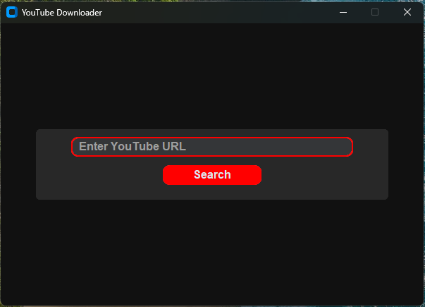
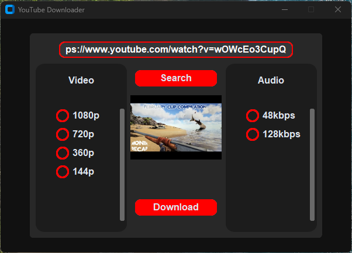

# YouTube Downloader App

This is a Python-based YouTube Downloader application that allows you to download videos or audio from YouTube in MP4 or MP3 formats. This app was built on Python 3.12.10. The app uses the following tools:

- **[pytubefix](https://github.com/JuanBindez/pytubefix)**: For handling YouTube video downloading.
- **[customtkinter](https://github.com/TomSchimansky/CustomTkinter)**: For creating a modern and user-friendly GUI.
- **[FFmpeg](https://ffmpeg.org/)**: For video and audio merging and format conversion.
- **[Pillow (PIL)](https://python-pillow.org/)**: For image display.

## Required libraries
- `pytubefix`
- `customtkinter`
- `Pillow`

## Installation

1. Clone the repository:
     ```bash
     git clone https://github.com/yourusername/yt-downloader.git
     cd yt-downloader
     ```

2. Install the required Python libraries:
     ```bash
     pip install pytubefix customtkinter pillow
     ```

3. Ensure FFmpeg is installed and accessible via the command line.

## Usage

1. Run the application:
     ```bash
     python main.py
     ```

2. Paste the YouTube video URL into the input field and click search.

3. Choose the desired format and quality (MP4 or MP3).

4. Click the "Download" button to start the download.

## Screenshots




## License

This project is licensed under the MIT License. See the [LICENSE](LICENSE) file for details.

## Acknowledgments

- Thanks to the developers of `pytubefix`, `customtkinter`, `FFmpeg`, and `Pillow` for their amazing tools.
- Inspired by the need for a simple and efficient YouTube downloader.

Feel free to contribute to this project by submitting issues or pull requests!